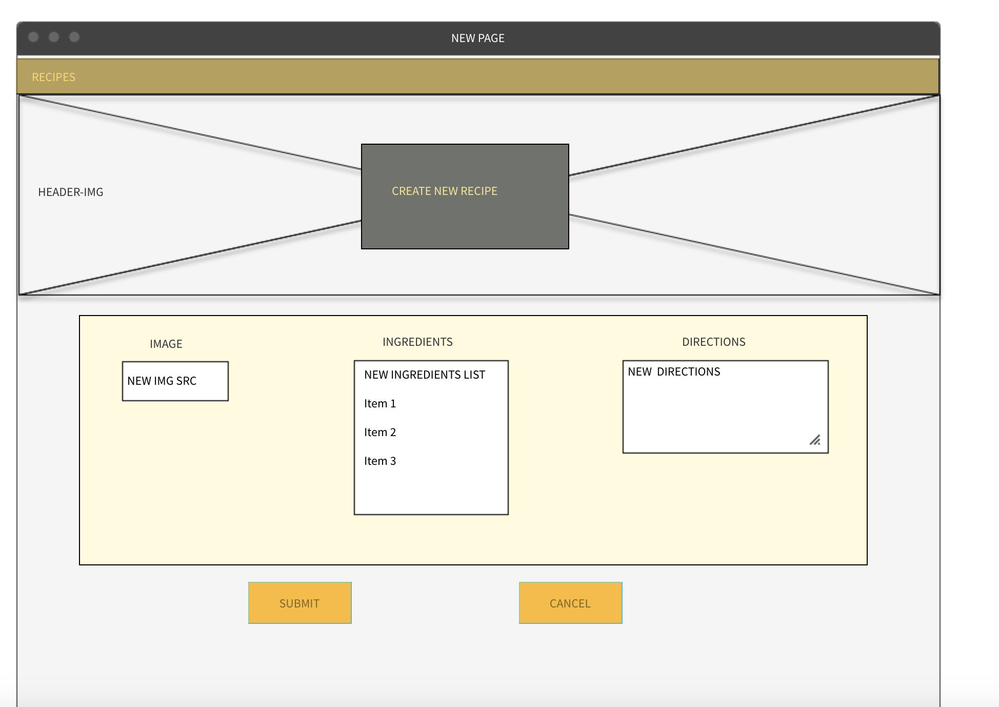
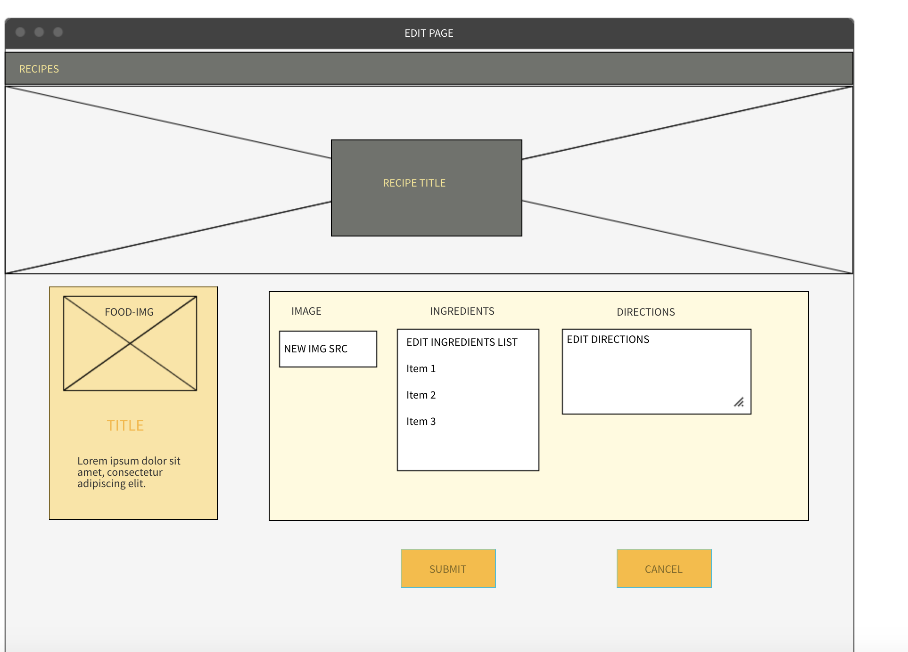

# regal-recipes

Building a simple CRUD application in the form of a recipe 

Technologies used : 

[HTML](https://developer.mozilla.org/en-US/docs/Web/HTML) 
[CSS](https://developer.mozilla.org/en-US/docs/Web/CSS) 
[Javascript](https://developer.mozilla.org/en-US/docs/Web/JavaScript) 
[jQuery](https://jquery.com/) 
[mongoDB](https://www.mongodb.com/) 
[mongoose](https://mongoosejs.com/) 
[express](https://expressjs.com/) 

Wireframe of application layout :

Index page 
 
New page 
 
Show Page 
 
Edit Page 
 

UNRESOLVED BUGS/ISSUES :

- Need to implement media queries.
- 