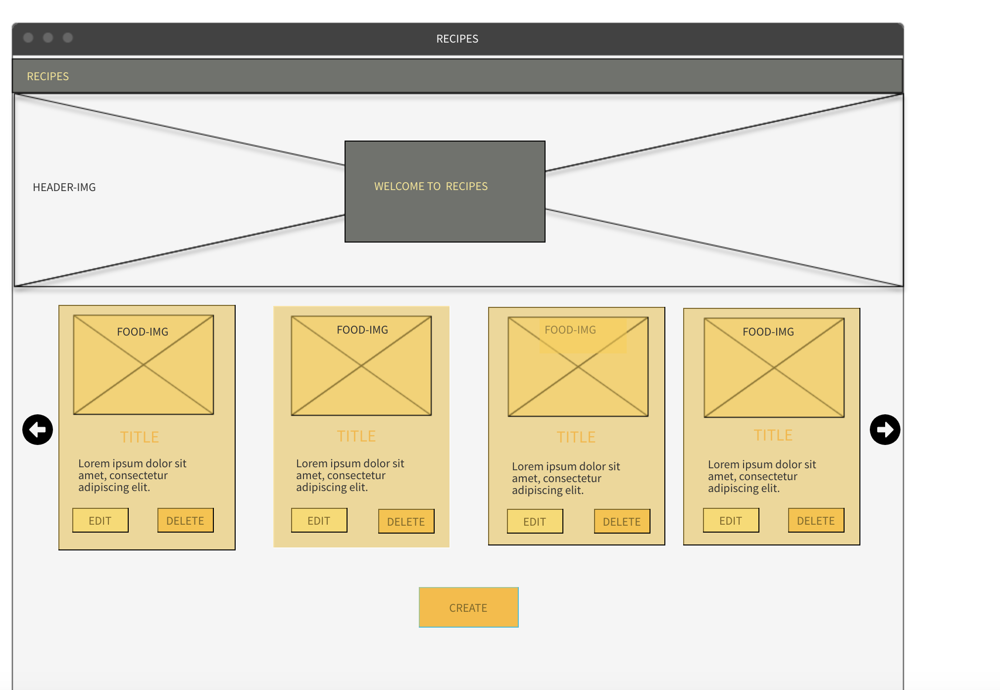
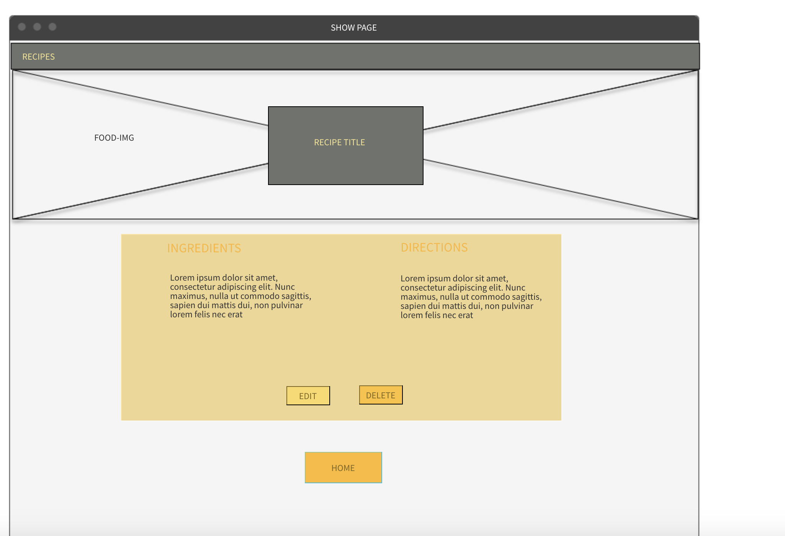

# regal-recipes

Building a basic CRUD application.

Technologies used : 

[HTML](https://developer.mozilla.org/en-US/docs/Web/HTML) 
[CSS](https://developer.mozilla.org/en-US/docs/Web/CSS) 
[Javascript](https://developer.mozilla.org/en-US/docs/Web/JavaScript) 
[jQuery](https://jquery.com/) 
[mongoDB](https://www.mongodb.com/) 
[mongoose](https://mongoosejs.com/) 
[express](https://expressjs.com/) 

Wireframe of application layout :

 
 
